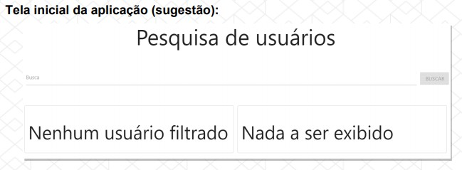
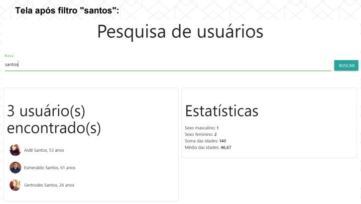

# Bootcamp Full Stack da IGTI
# Desafio - Módulo 1

## Objetivos

Exercitar os seguintes conceitos trabalhados no Módulo:

- [x] Declarar elementos HTML como títulos, input, div, span, ul, li etc.
- [x] Estilizar o app com CSS.
- [x] Mapear elementos do DOM para serem manipulados com JavaScript.
- [x] Formatar valores com JavaScript.
- [x] Realizar diversos cálculos com array methods como map, filter e reduce.
- [x] Realizar requisições HTTP com o comando fetch.

## Enunciado

Criar uma aplicação para filtrar usuários e mostrar estatísticas a partir do filtro definido.

## Atividades

Os alunos deverão desempenhar as seguintes atividades:

1. Na carga inicial da aplicação, obter os dados de:
https://randomuser.me/api/?seed=javascript&results=100&nat=BR&noinfo

2. Carregar os dados dos usuários em um array.

3. Permitir a filtragem de usuários através de um input com interação do usuário.

4. O usuário poderá filtrar dados quando digitar pelo menos um caractere no input.

5. O usuário poderá filtrar os dados tanto digitando "Enter" quanto clicando no botão
correspondente, conforme imagens mais abaixo.

6. Montar dois painéis.

7. No painel da esquerda, listar os usuários filtrados.

8. No painel da direita, calcular e mostrar algumas estatísticas sobre esses usuários,
conforme imagens abaixo.




## Questionário

Após terminar de desenvolver a aplicação, teríamos que responder a um questionário.

## Para rodar a aplicação::arrow_forward:

Clone o projeto via terminal:

```
git clone https://github.com/ahakawa/igti-desafio-mod-1.git
```

Entre no diretório do projeto:

```
 cd igti-desafio-mod-1/
```

Instale as dependências:

```
npm install
```

Instale a extensão do live server no VSCode e o inicie

Rode o json server:

```
json-server db.json
```

```
*** Durante o desenvolvimento, a API do Randomuser estava instável e não trazia os dados da requisição.
Por isso que configurei o json server.
```


